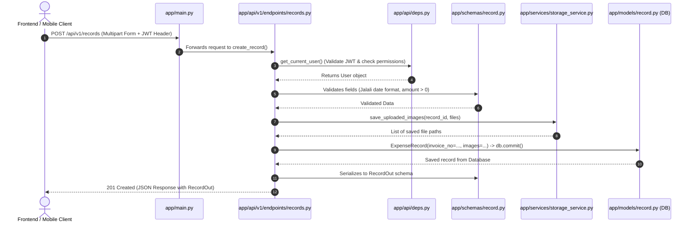

# 📁 FastAPI Project Structure & Code Architecture Guide

A complete guide to organizing code, naming files and folders, and designing a clean, scalable architecture in **FastAPI** — specifically tailored for developers transitioning from desktop or monolithic Python scripts.

---

## 📑 Table of Contents
1. [Standard Project Layout (The "Layered Architecture")](#1-standard-project-layout-the-layered-architecture)
2. [Folder & File Breakdown (What Goes Where and Why)](#2-folder--file-breakdown-what-goes-where-and-why)
3. [The Request Lifecycle: How Data Flows Between Files](#3-the-request-lifecycle-how-data-flows-between-files)
4. [Naming Conventions in FastAPI](#4-naming-conventions-in-fastapi)
5. [Models vs. Schemas: The Most Crucial Concept](#5-models-vs-schemas-the-most-crucial-concept)
6. [Top 7 Beginner Mistakes to Avoid](#6-top-7-beginner-mistakes-to-avoid)

---

## 1. Standard Project Layout (The "Layered Architecture")

In FastAPI, the industry-standard structure uses a **Layered (3-Tier) Architecture**:
1. **Presentation Layer (`app/api/`)**: Routers, URL paths, HTTP request handling, headers, status codes.
2. **Business / Service Layer (`app/services/` & `app/crud/`)**: Application logic, calculations, file processing, permission enforcement.
3. **Data / Persistence Layer (`app/models/` & `app/db/`)**: Database tables, relationships, connections, migrations.
4. **Data Transfer Layer (`app/schemas/`)**: Pydantic models for request validation and response formatting.

### 🌳 Visual Folder Tree

```text
imprest_project/
│
├── app/                                # Root Python application package
│   ├── __init__.py                     # Makes 'app' a Python package
│   │
│   ├── main.py                         # FastAPI app instance, middleware, router inclusions, lifecycle
│   │
│   ├── api/                            # HTTP presentation layer (Endpoints & Routers)
│   │   ├── __init__.py
│   │   ├── deps.py                     # Common dependencies (get_db, get_current_user, require_admin)
│   │   └── v1/                         # API Version 1
│   │       ├── __init__.py
│   │       ├── api_router.py           # Master router that includes all endpoint routers
│   │       └── endpoints/              # One file per functional domain
│   │           ├── __init__.py
│   │           ├── auth.py             # POST /login, POST /refresh, GET /me
│   │           ├── users.py            # User management (admin only)
│   │           ├── records.py          # CRUD for expense receipts & invoices
│   │           ├── categories.py       # Lookup categories (expense centers, types, companies)
│   │           └── exports.py          # GET /exports/excel, GET /exports/pdf
│   │
│   ├── core/                           # Core infrastructure & configuration
│   │   ├── __init__.py
│   │   ├── config.py                   # Pydantic Settings class (reads .env file)
│   │   ├── security.py                 # Password hashing (bcrypt) & JWT token encoding/decoding
│   │   └── logger.py                   # Centralized logging setup
│   │
│   ├── db/                             # Database infrastructure
│   │   ├── __init__.py
│   │   ├── session.py                  # SQLAlchemy engine and SessionLocal factory
│   │   ├── base.py                     # Imports all ORM models for Alembic auto-generation
│   │   └── init_db.py                  # Database seeder (creates default admin & seed data)
│   │
│   ├── models/                         # SQLAlchemy ORM Models (Database Tables)
│   │   ├── __init__.py                 # Exports User, ExpenseRecord, RecordImage, Category
│   │   ├── user.py                     # User table definition
│   │   ├── record.py                   # ExpenseRecord & RecordImage tables
│   │   └── category.py                 # ExpenseCenter, ExpenseType, Company tables
│   │
│   ├── schemas/                        # Pydantic Schemas (Request/Response Validation DTOs)
│   │   ├── __init__.py
│   │   ├── token.py                    # Token, TokenPayload
│   │   ├── user.py                     # UserCreate, UserUpdate, UserOut, UserLogin
│   │   ├── record.py                   # RecordCreate, RecordUpdate, RecordOut, RecordFilter
│   │   └── category.py                 # CategoryCreate, CategoryOut
│   │
│   ├── services/                       # Reusable business logic & file processors
│   │   ├── __init__.py
│   │   ├── record_service.py           # Verification rules, soft deletion, record logic
│   │   ├── storage_service.py          # File upload saving, directory creation, file deletion
│   │   └── export_service.py           # OpenPyXL excel generation & ReportLab PDF creation
│   │
│   └── utils/                          # Generic utility functions & helpers
│       ├── __init__.py
│       └── solar_date.py               # Jalali date parsing, validation, and Gregorian conversion
│
├── alembic/                            # Alembic database migration scripts
│   ├── env.py
│   └── versions/                       # Migration files (e.g. 0001_create_initial_tables.py)
│
├── uploads/                            # Server directory for receipt attachments
│   └── <record_id>/                    # Each record gets its own subfolder (e.g., 001.jpg, 002.png)
│
├── tests/                              # Pytest test suite
│   ├── __init__.py
│   ├── conftest.py                     # Test fixtures (test database, test client, test JWT token)
│   ├── test_auth.py                    # Tests for login & token generation
│   ├── test_records.py                 # Tests for record creation, filters, permissions
│   └── test_exports.py                 # Tests for Excel/PDF export status codes
│
├── .env                                # Local environment variables (DO NOT commit to git)
├── .env.example                        # Template environment variables (commit to git)
├── .gitignore                          # Ignored files (.venv, .env, __pycache__, uploads/, *.db)
├── alembic.ini                         # Alembic configuration
├── Dockerfile                          # Production container recipe
├── docker-compose.yml                  # Multi-container orchestration (App + Postgres)
├── README.md                           # Project documentation & run instructions
└── requirements.txt                    # Project dependencies with pinned versions
```

---

## 2. Folder & File Breakdown (What Goes Where and Why)

### 🔹 `app/main.py` (The Application Gateway)
- **Role:** The entry point executed by Uvicorn.
- **What belongs here:**
  - Instantiating `FastAPI()`.
  - Adding CORS and security middleware.
  - Mounting static folders (e.g., `app.mount("/uploads", StaticFiles(...))`).
  - Including routers from `app/api/v1/api_router.py`.
  - Startup/shutdown lifespan events.
- **What DOES NOT belong here:** Route handler implementations or database queries.

---

### 🔹 `app/core/` (Configuration & Cross-Cutting Concerns)
- **`config.py`**:
  - Uses `pydantic-settings` to define typed settings (`Settings` class).
  - Automatically loads `.env` variables (e.g., `DATABASE_URL`, `SECRET_KEY`, `ACCESS_TOKEN_EXPIRE_MINUTES`).
- **`security.py`**:
  - Contains password hashing utilities: `verify_password()`, `get_password_hash()`.
  - Contains JWT functions: `create_access_token()`.
- **Why this folder exists:** Anything that is shared across the entire application and is not tied to a single business domain belongs in `core/`.

---

### 🔹 `app/models/` (Database Tables / ORM Entities)
- **Role:** Defines your database schema using SQLAlchemy 2.0.
- **File naming:** Singular nouns in snake_case (e.g., `user.py`, `record.py`, `category.py`).
- **Characteristics:**
  - Inherits from `app.db.session.Base`.
  - Contains SQLAlchemy types: `Column(Integer, primary_key=True)`, `relationship(...)`, `ForeignKey(...)`.
  - **Never** used for HTTP request body validation.

---

### 🔹 `app/schemas/` (Data Transfer Objects & Validation)
- **Role:** Defines the exact shape of incoming request bodies and outgoing JSON responses using **Pydantic**.
- **Naming Pattern for Classes:**
  - `ModelBase`: Common fields shared by create/update/out.
  - `ModelCreate`: Fields required when creating a new record (e.g., `RecordCreate`).
  - `ModelUpdate`: Fields that can be modified (all optional).
  - `ModelOut` or `ModelResponse`: The shape of data returned to clients (includes `id`, `created_at`, formatted URLs).
- **Why separate from `models/`:**
  - Security: You don't want to expose `hashed_password` in responses.
  - Validation: Pydantic validates types (e.g., checking if Jalali date format is `YYYY/MM/DD`).

---

### 🔹 `app/api/` (Presentation & Routing)
- **`deps.py`**:
  - Contains reusable FastAPI dependencies (`Depends()`).
  - `get_db()`: Yields a database session per request and closes it safely.
  - `get_current_user()`: Decodes the JWT token from the `Authorization: Bearer <token>` header, fetches the user from DB.
  - `require_admin()`: Verifies that `current_user.role == "admin"`.
- **`v1/endpoints/`**:
  - Contains route handler functions decorated with `@router.get`, `@router.post`, etc.
  - Each file matches a domain (e.g., `records.py`, `auth.py`).
- **`v1/api_router.py`**:
  - Aggregates all individual endpoint routers with appropriate prefixes:
    ```python
    api_router = APIRouter()
    api_router.include_router(auth.router, prefix="/auth", tags=["Authentication"])
    api_router.include_router(records.router, prefix="/records", tags=["Expense Records"])
    ```

---

### 🔹 `app/services/` (Business Logic Layer)
- **Role:** Keeps your API endpoint functions slim and readable.
- **What belongs here:**
  - File saving and folder creation logic (`storage_service.py`).
  - Excel sheet styling, column width calculation, and cell population (`export_service.py`).
  - PDF document canvas layout and image rendering (`export_service.py`).
  - Complex multi-step operations (e.g., validating duplicate invoice + saving file + committing DB transaction).

---

### 🔹 `app/utils/` (Generic Helpers)
- **Role:** Reusable pure helper functions independent of FastAPI or the database.
- **Example:** `solar_date.py` containing conversion routines between Solar/Jalali dates (`1403/06/22`) and Gregorian dates (`2024-09-12`).

---

## 3. The Request Lifecycle: How Data Flows Between Files

When a client makes a request (e.g., creating an expense receipt), data travels cleanly across layers:



---

## 4. Naming Conventions in FastAPI

Following standard Python (PEP 8) and FastAPI conventions is essential:

| Item | Convention | Example |
| :--- | :--- | :--- |
| **Directory Names** | All lowercase, snake_case | `api`, `core`, `services`, `solar_utils` |
| **Python Files** | All lowercase, snake_case | `records.py`, `solar_date.py`, `storage_service.py` |
| **ORM Model Classes** | PascalCase, Singular | `User`, `ExpenseRecord`, `RecordImage` |
| **Pydantic Schema Classes** | PascalCase with suffix | `RecordCreate`, `RecordUpdate`, `RecordOut`, `UserLogin` |
| **Functions & Methods** | snake_case | `get_record_by_id()`, `create_access_token()` |
| **Dependencies** | snake_case, prefixed with `get_` or `require_` | `get_db()`, `get_current_user()`, `require_admin()` |
| **API URL Routes** | kebab-case or plural lowercase nouns | `/api/v1/records`, `/api/v1/expense-centers` |
| **Environment Variables** | UPPERCASE_SNAKE_CASE | `DATABASE_URL`, `SECRET_KEY`, `ACCESS_TOKEN_EXPIRE_MINUTES` |

---

## 5. Models vs. Schemas: The Most Crucial Concept

Beginners often confuse **SQLAlchemy Models** and **Pydantic Schemas**. Here is the clear distinction:

```
┌────────────────────────────────────────────────────────┐
│                   SQLAlchemy Model                     │
│               (app/models/record.py)                   │
│  - Represents the Database Table                       │
│  - Communicates with SQLite / PostgreSQL               │
│  - Handles foreign keys, relationships, cascade deletes│
└──────────────────────────┬─────────────────────────────┘
                           │ Read/Write
                           ▼
┌────────────────────────────────────────────────────────┐
│                    Pydantic Schema                     │
│               (app/schemas/record.py)                  │
│  - Represents the HTTP Request / Response              │
│  - Validates client input types & formats              │
│  - Filters and shapes output JSON (e.g. hides password)│
└────────────────────────────────────────────────────────┘
```

### Side-by-Side Example:

#### The Model (`app/models/record.py`):
```python
class ExpenseRecord(Base):
    __tablename__ = "records"
    id = Column(String(36), primary_key=True, default=lambda: str(uuid.uuid4()))
    invoice_no = Column(String(100), nullable=False)
    amount = Column(Float, nullable=False)
    deleted = Column(Boolean, default=False)
    created_by_id = Column(Integer, ForeignKey("users.id"))
```

#### The Schema (`app/schemas/record.py`):
```python
# Input Schema (What the user sends)
class RecordCreate(BaseModel):
    invoice_no: str
    amount: float = Field(..., gt=0)

# Output Schema (What the client receives)
class RecordOut(BaseModel):
    id: str
    invoice_no: str
    amount: float
    created_by_name: str
    
    class Config:
        from_attributes = True  # Allows converting SQLAlchemy model to Pydantic object
```

---

## 6. Top 7 Beginner Mistakes to Avoid

### 1. ❌ Putting Business Logic in `main.py`
- **Mistake:** Defining 20 `@app.get` and `@app.post` routes all inside `main.py`.
- **Solution:** Keep `main.py` under 50 lines. Use `APIRouter()` in dedicated files inside `app/api/v1/endpoints/`.

### 2. ❌ Not Using `response_model`
- **Mistake:** Returning raw dictionaries or ORM objects directly without specifying `response_model=RecordOut`.
- **Solution:** Always declare `response_model=...` on route decorators. This guarantees type safety, automatic OpenAPI documentation, and prevents data leaks.

### 3. ❌ Direct Global Database Connections
- **Mistake:** Creating one global `db = sqlite3.connect()` and sharing it across threads.
- **Solution:** Use FastAPI's dependency injection `db: Session = Depends(get_db)` so every HTTP request gets its own session that automatically closes.

### 4. ❌ Mixing `async` and Blocking Sync Code
- **Mistake:** Declaring `async def create_record(...)` while performing blocking operations like `time.sleep()`, synchronous `openpyxl`, or standard SQLite queries.
- **Solution:** In FastAPI, if you use standard synchronous libraries (like standard SQLAlchemy ORM, openpyxl, or reportlab), declare your endpoint as **regular `def`** (not `async def`). FastAPI will automatically execute it in a thread pool without blocking the main event loop!

### 5. ❌ Hardcoding Secrets in Code
- **Mistake:** Setting `SECRET_KEY = "my_secret_123"` inside Python files.
- **Solution:** Place all secrets in `.env` and read them via `pydantic-settings` in `app/core/config.py`.

### 6. ❌ Storing Images as Blobs in Database
- **Mistake:** Converting images to Base64 strings or binary blobs directly inside database columns.
- **Solution:** Save files to the filesystem (`/uploads/<record_id>/001.jpg`) and store only the relative path/URL in the database.

### 7. ❌ Skipping Migration Tools
- **Mistake:** Modifying columns by editing `CREATE TABLE` strings manually or deleting the database file.
- **Solution:** Use **Alembic** (`alembic revision --autogenerate -m "add column"`) to track database schema changes over time.
